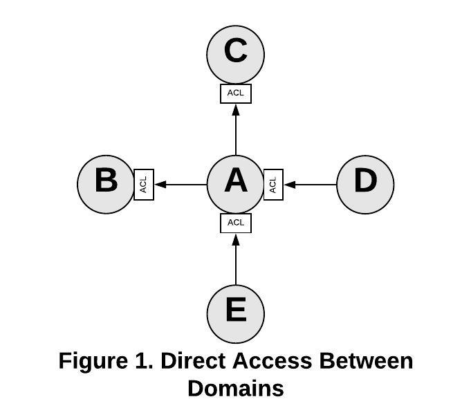

# The University API Specification and Domain Services

## Introduction
The University API (UAPI) specification is intended to bring a level of standardization to APIs that OIT provides for cross-domain access to data. The UAPI specification can and should be used by domain APIs. The purpose of this document is to provide guidance to domain teams in applying the UAPI specification within their domains.

## What Is Cross-Domain Access?

Domains are organized around business systems or processes. Very few domains can function without data from other domains. APIs are the preferred method of accessing data from another domain. Direct database access should only be used in exceptional circumstances and with approval of all parties involved.  

### Sharing Data Between Domains

[Domain Driven Design](https://en.wikipedia.org/wiki/Domain-driven_design) specifies a number of strategies for domains to communicate with each other. Among them are Conformist, AntiCorruption Layers, and Open Host/Published Language. 

In any real environment there are multiple layers to these interactions. The technical level deals with the protocols, encodings, etc. used in the interaction. The model level specifies the translations between model elements such as data definitions, concepts, relationships between data, etc. The UAPI Specification deals almost exclusively with the technical level of these interactions. The BYUAPI adds model level details to the interactions for each of the provided resources (and sub-resources). These details should be found in the Swagger definition files along with additional documentation provided to consumers. 

#### Conformist

Conformist interaction is appropriate when a consuming domain is willing to conform to the model and technical interactions specified by a providing domain. By choosing to conform to the providing domain's model the consumer has less work to do in interacting with the provider. But the consumer is binding their model to that of the provider. Changes to the provider model will cause the consumer to adjust their model to match. 
This tight coupling can be problematic for both consumer and provider depending upon the relationship between the domain teams. 

#### AntiCorruption Layer

An AntiCorruption Layer (ACL) is built by the consumer to keep elements of the model of the provider domain from leaking into the consumer's domain. The ACL isolates the translation from supplier to consumer models to a single location within the consumer. ACLs are required for each relationship with a different supplier. ACLs can consist of multiple layers, such as a layer to interact with the supplier at the technical level and a separate translation later to map supplier model concepts into the model of the consumer. 

#### Open Host / Published Language

There are times when it makes sense for a domain to publish a single set of services tht all other domains can use. In DDD terms this is called an Open Host (OH). Any domain that wishes to interact with the provider domain does so through the services provided by the provider domain's Open Host. Tightly aligned with the Open Host is the concept of a Published Language. The supplier domain can publish a simplified and standardized description of their model that the Open Host will support. Consuming domains can then use the published language as the model their ACLs use. The provider is free to make modifications to their model as long as the Open Host and Published Language don't change. Changes to the Open Host or Published Language require coordination with all consumers, typically through a versioning/deprecation model. 


### Application to the BYUAPI, UAPI Specification and Domain APIs

The BYUAPI is the implementation of the UAPI specification with BYU specific resources including Students, Employees, Persons, etc. The BYUAPI is implemented as a [facade](https://en.wikipedia.org/wiki/Facade_pattern) on the top of domain APIs. The UAPI specification allows consumers to conform to a single JSON and URL format and function when interacting with all compliant APIs. Domain APIs that are UAPI specification compliant are not necessarily part of the BYUAPI.



Consider the above example. Domain A provides APIs to domains B and C and consumes APIs from domains D and E. If domain A chooses to define a unique API specification domains B and C must implement an ACL for all interactions with domain A in order to isolate itself from the model and interaction requirements of domain A. Domain A must also implement ACLs for all interactions with D and E for the same reason. Any changes domain A needs to make to the services it provides must be coordinated with domains B and C so those domains can change their corresponding ACLs. Domain A must also respond to any changes D and E make to the APIs it is consuming.    


Now consider how the relationships change if some or all domains conform to the UAPI specification for cross-domain APIs and provide or consume APIs via the BYUAPI where possible. 

The BYUAPI is an implementation of the Open Host/Published Language model. At a technical level the UAPI specification provides a single technical specification that all compliant APIS. The BYUAPI specifies the model for any provided resources provided by those APIs. 

Domain A has chosen to provide its resources to the BYUAPI via a UAPI compliant implementation. This simplifies the ACL the BYUAPI must implement to include only a translation between the domain model and the BYUAPI model. Domain D has chosen to conform to the UAPI specification for the technical aspects of the APIs, providing an Open Host and Published Language. This means that in order to consume the resources provided by domain D, domain A's ACL simply needs to handle translation between models. A reusable piece of code could be used for all UAPI compliant interactions. Domain E has chosen not to be compliant to the UAPI specification. This requires domain A to implement a unique ACL for domain E that includes both technical and model translations. 

Domain B has chosen to conform to the model provided by the BYUAPI as expressed in the Open Host/Published Language. This eliminates the need for translation between models. A single UAPI interface is all that is required for that interaction. The BYUAPI will mitigate some of the issues with the Conformist approach because it is meant to isolate consuming domains from changes to the provider domain. 

Domain C has unique requirements for its model that prevent it from being able to conform to the BYUAPI model directly (third party application, etc). In this case the domain has chosen to create an ACL between itself and the BYUAPI Open Host/Published Language. This ACL can be a model only translation. 

## Implications Of Varying From The Specification

In general any externally consumable APIs provided by a domain should conform to as much of the UAPI specification as possible even if it is not technically part of the BYUAPI. 

### BYUAPI Implications

The BYUAPI owns no domain data. BYUAPI provided resources are aggregations of data from a number of underlying domains. The closer the APIs from the underlying domains follow the UAPI specification the less work the BYUAPI facade layer has to do. If the domain API is fully compliant the API Manager may be the only part of the facade necessary. 

### Domain Implications

Domains seldom exist in isolation. Within a domain the team is free to choose whatever type of interaction that meets their needs. But when a domain team chooses to provide their own specifications for interaction with other domains they increase the workload of other domains and also require those domains to be tightly coupled which complicates things in the future. 

## Domain API Implementation Details

### URL Namespaces
The URL namespace designated for Domain APIs is:

```
https://api.byu.edu/domains/{domain_name}
```

The *domain\_name* portion of the Domain API URL namespace is determined by the domain team. For example, if a domain team had chosen the domain name "identity," its namespace would be `https://api.byu.edu/domains/identity`. All domain APIs would reside under that URL within the API Manager. All UAPI spec compliant APIs that are designated as part of the BYUAPI are under the `https://api.byu.edu/byuapi` URL namespace. 

### API Management

Domain APIs provided for use by other domains and the BYUAPI are required to be managed by the API Manager. Intra-domain APIs that are exclusively used within a domain can be managed by the API Manager but are not required to be. If the domain team chooses to not use the API Manager they still should address authorization, authentication, and monitoring.