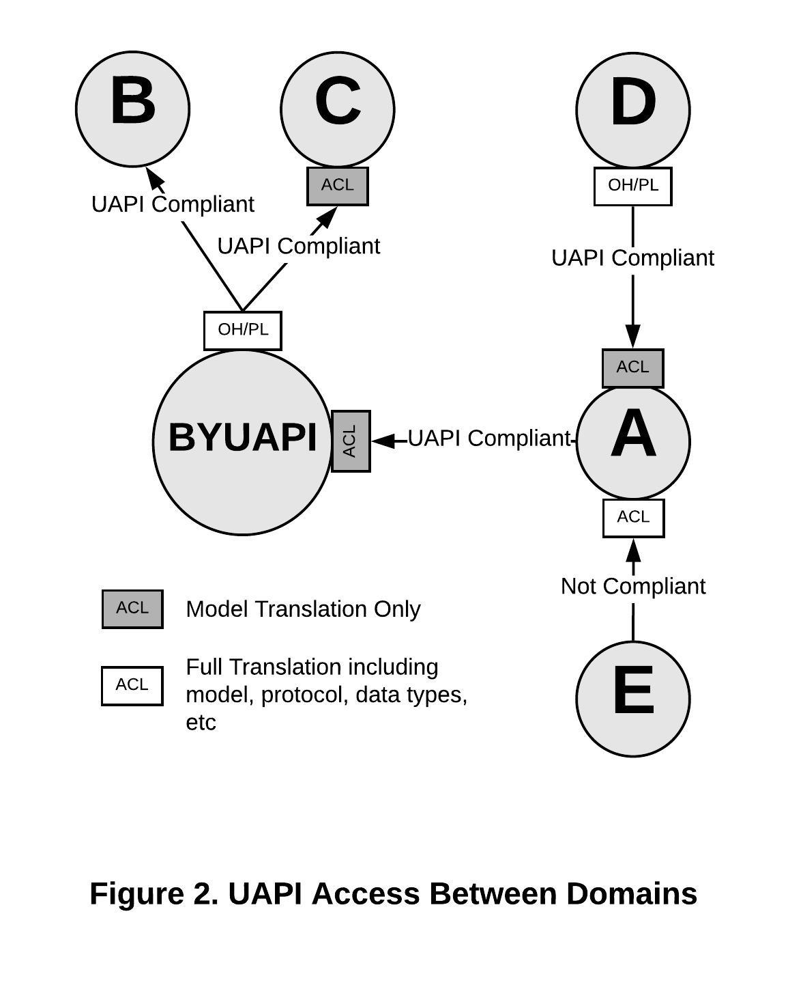

# The University API Specification and Domain Services

## Introduction
The University API (UAPI) specification is intended to bring a level of standardization to APIs that OIT provides for cross-domain access to data. The UAPI specification can and should be used by domain APIs. The purpose of this document is to provide guidance to domain teams in applying the UAPI specification within their domains.

## What Is Cross-Domain Access?

Domains are organized around business systems or processes. Very few domains can function without data from other domains. APIs are the preferred method of accessing data from another domain. Direct database access should only be used in exceptional circumstances and with approval of all parties involved.  

## UAPI Spec And The BYUAPI

The BYUAPI is the implementation of the UAPI specification with BYU specific resources including Students, Employees, Persons, etc. The BYUAPI is implemented as a [facade](https://en.wikipedia.org/wiki/Facade_pattern) on the top of domain APIs. The UAPI specification allows consumers to conform to a single JSON and URL format and function when interacting with all compliant APIs. Domain APIs that are UAPI specification compliant are not necessarily part of the BYUAPI. 

## Implications of varying from the specification

In general any externally consumable APIs provided by a domain should conform to as much of the UAPI specification as possible. 

### Coupling Between Domains


Consider the above example. Domain A provides APIs to domains B, C, D, E, and F and consumes APIs from domains G and H. If domain A chooses to define a unique API specification domains B, C, D, E, and F must implement a translation layer (ACL) for all interactions with A. A must also implement a translation layer for all interactions with G and H for the same reason. Any changes A needs to make to the services it provides must be coordinated with all consuming domains (tight coupling). Domain A must also respond to any changes G or H make to the APIs it is consuming.    



Now consider how the relationships change if some or all domains conform to the UAPI specification for cross-domain APIs. In this example some of the APIs provided by domain A are part of the BYUAPI implementation. For those APIs domains B, C, and D can access their needed APIs via the BYUAPI. This reduces the coupling domain A needs to be concerned with to a single relationship with the BYUAPI. The APIs domain A consumes from domain G are also part of the BYUAPI and again the coupling for G is reduced to only the relationship with the BYUAPI. Domains E, F, and H are not part of the BYUAPI. While the tight coupling between domains remains because they are UAPI specification compliant the need for a translation layer is eliminated.  

### BYUAPI impacts

The BYUAPI owns no domain data. BYUAPI provided resources are aggregations of data from a number of underlying domains. The closer the APIs from the underlying domains follow the UAPI specification the less work the BYUAPI facade layer has to do. If the domain API is fully compliant the API Manager may be the only part of the facade necessary. 

## Implementation considerations

### URL Namespaces
The URL namespace designated for Domain APIs is:

```
https://api.byu.edu/domains/{domain_name}
```

The *domain\_name* portion of the Domain API URL namespace is determined by the domain team. For example, if a domain team had chosen the domain name "identity," its namespace would be `https://api.byu.edu/domains/identity`. All domain APIs would reside under that URL within the API Manager. All UAPI spec compliant APIs that are designated as part of the BYUAPI are under the `https://api.byu.edu/byuapi` URL namespace. 

### API Management

Domain APIs provided for use by other domains and the BYUAPI are required to be managed by the API Manager. Intra-domain APIs that are exclusively used within a domain can be managed by the API Manager but are not required to be. If the domain team chooses to not use the API Manager they still should address authorization, authentication, and monitoring.