# Test-driving the Persons API With Postman

The Persons API (V2) is a good example of an API that conforms to the University API (UAPI) Specification. The Persons API provides access to a large amount of identity data if the user knows how to operate it correctly. It is also a good model for how to operate all UAPI conformant APIs.

We will use Postman - an interactive REST client - to explore some of what the Persons API can do.

## API Manager Setup

The Persons API, like all of BYU's APIs, is managed by our API Manager. In order to access any API through the API Manager a consumer must generate a set of access keys. That is our first step.  

Access the [API Manager Store](https://api.byu.edu/store). Click the `Login` button in the upper right corner of the page to authentication with the API Manager Store. Authentication is required to generate access keys.

Gaining access to an API through the API Manager is a two step process. First we need to create an application. Second we will have our application subscribe to use the Persons API.

An application represents a group of APIs. For a normal application you would create one application and add subscriptions to all the APIs that application will use. We will create a single application and add a subscription for the Persons API.

To create an application click on the `My Applications` button on the top of the page. Give the application a `Name` and optional description. The rest of the fields can be the default for this tutorial.  Click `Add` to create our new application.

Now we need to generate a `client_id` and `client_secret` for our application. These uniquely identify this application to the API Manager. The `client_id` is similar to a `net_id` and is considered public. The `client_secret` is similar to a password and should be kept confidential. If the `client_secret` is compromised the application will need to be deleted and a new one created in order to generate new credentials.

To generate the credentials click on the `My Subscriptions` button at the top of the window. Be sure that the correct application is selected and click on the `Generate keys` button. After a few seconds the keys will be displayed. The `client_id` is labeled the `Consumer Key` on the page and the `client_secret` is labeled the `Consumer Secret`. Save those two values, you'll need them later (you can always return to this page to retrieve the values when you need them).

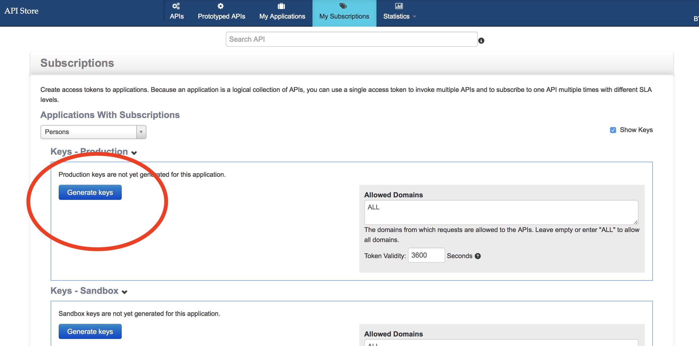

Now we need to find the Persons API and subscribe to it. Since there are hundreds of APIs in the store we'll search for the API. Click on the `APIs` button at the top of the page to bring up the list of APIs in the store. Enter "Persons" in the search field at the top of the page and press enter. 

On the list of matching APIs select version 2 (v2) of the Persons API.

Now we need to subscribe to the Persons API. Make sure your application is selected and click on the `Subscribe` button. This will add a subscription.

>**Note** - the API Store has an API Console where you can try calling APIs. The console will not work for this API.

That is it for the API Manager setup.  

## Postman Setup

We are going to use Postman to explore the Persons API. Postman is a full feature REST client that can either run as a browser extension or as a standalone application for any major OS.

Download Postman from their [site](https://getpostman.com/apps). You can choose either a browser extension or a native application. Either will work for our purposes. You do not need to create an account with Postman unless you'd like to take advantage of some more advanced features.

Once Postman is installed we need to create a Postman environment that will store our configuration. Download the skeleton environment and configuration files for this tutorial:

 {**need link to postman environment from GitHub **}
In Postman click on the `Import` button and select the two downloaded files. This will add the configurations to the environment.

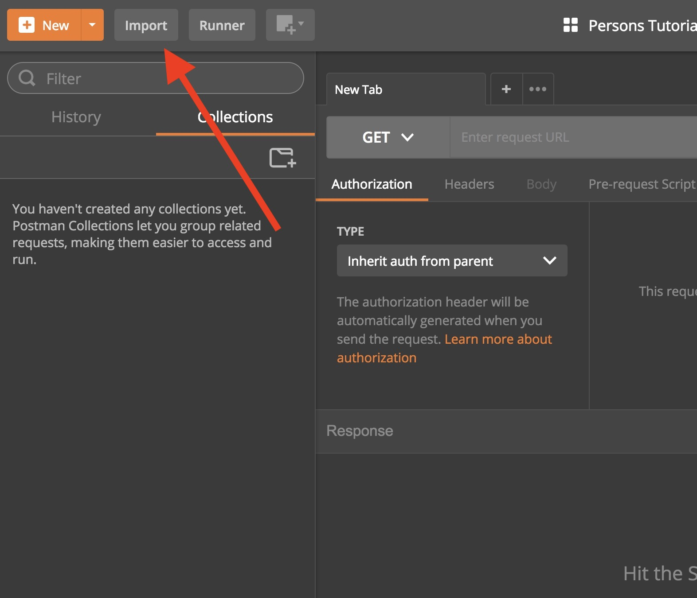

Once you have imported the configuration make sure the environment selection is set to "Persons". Click on the `Environment Quick Look` button to see the values in the environment.

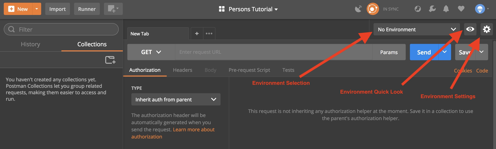

Click the `Edit` link to open the environment editor. Fill in the values for `client_id` and `client_secret` from your API Manager application. Put the values for your BYU netid and password in the `username` and `password` fields. These are necessary for authenticating to the API Manager and the Persons API. The `accessToken` will be filled in programmatically later. 

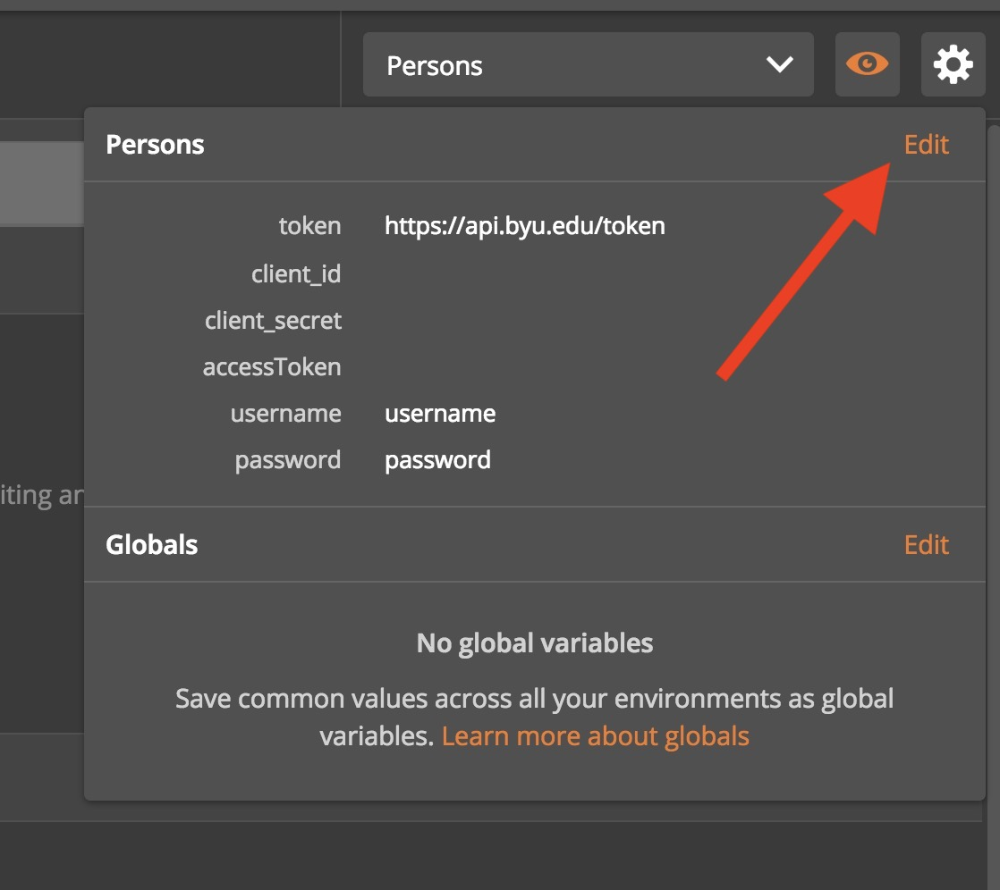

## Exploring the Persons Resource

Now that Postman is configured the next step is to actually access the API. The Postman API is protected by the API Manager so it requires an `Authorization` header with an OAuth 2.0 Bearer token. The specifics of OAuth are the subject for a another day so the Postman configuration you loaded comes with the `Get Password Access Token` API call that will obtain the Bearer token for you and put it into the `accessToken` environment variable. All the other API calls in the configuration are configured to add the `Authorization` header with the appropriate value. The `accessToken` is only good for one hour so you may need to run the `Get Password Access Token` API call occasionally as you work with the API.

The `accessToken` identifies you and your API Manager application to the Persons API service (that is why you had to add the client credentials and your netid and password to the Postman environment). The Postman service will use this identification to determine what data the API will provide.

To obtain the access token select the `Get Password Access Token` service on the list of API calls on the left of the page (be sure the `Collections` tab is selected to see the provided API calls). Click the `Send` button to execute the API call.

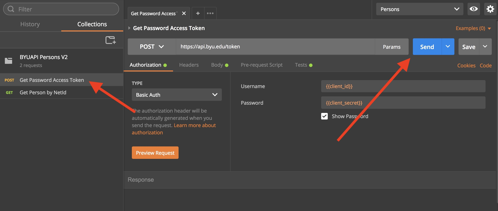

If all goes well you should receive a 200 HTTP status code and a JSON object that contains the access token along with some other data. There is a test script that Postman runs after the call returns that will copy the `access_token` to the `accessToken` variable in the environment for the rest of the API calls to use.

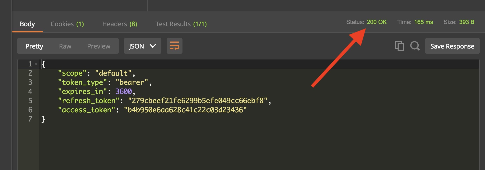

If you receive an error message be sure you have put your `client-id`, `client-secret`, netid, and password in the environment correctly.

### Looking Up A Resource By Netid

The identifer that the Person's API uses is the `byu_id`. Most users don't know what that number is (it's the number on the id card). So we'll start by looking up information by using a netid - something that everybody should know.

One of the features of UAPI compliant APIs is the ability specify filters on the request. In our case we'll filter on `net_id` so we don't have to know what the `byu_id` is. Click on the `Get Person by Netid` API call on the left. Postman will open a new tab. The URL for the Persons API is `https://api.byu.edu/byuapi/persons/v2/`. Access to all features of the API go though this URL.

In Postman modify the URL for the `Get Persons by Netid` and change the `?net_id=adddrop` filter to specify your netid instead of the test id and press `Send`.

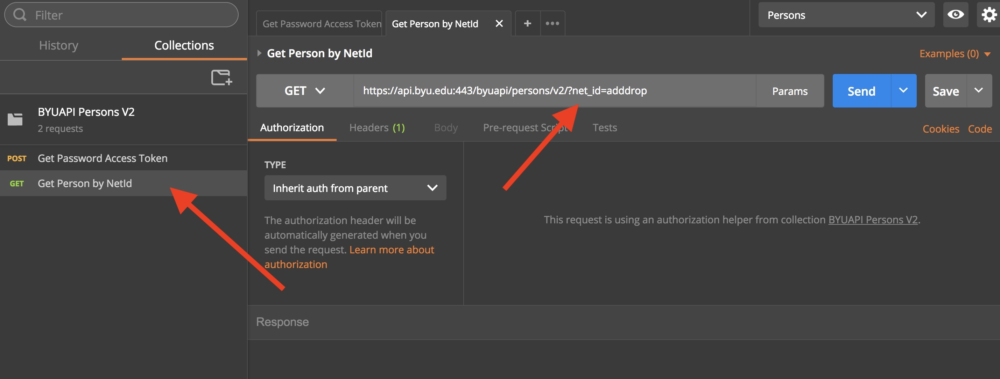

The Persons API will return a JSON object (don't panic about the size). There is a standard format that all the UAPI compliant APIs use. Let's explore this structure a little.

Postman's response window understands JSON and allows for collapsing parts of the object. We'll take advantage of this feature to get an overview of the response object. In the left margin of the response there are little arrows next to the line numbers.

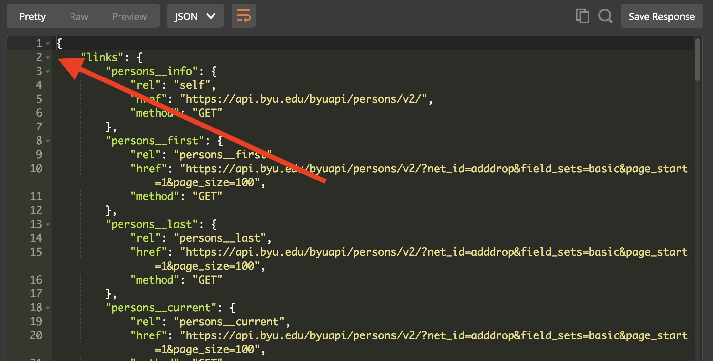

Click on the arrow next to the `links` property to collapse that portion of the object. You'll see the `links` property collapse and the `metadata` will appear. Do the same thing for the `metadata` and `values` array for now. You'll see that the response has these three main components. All UAPI compliant APIs will return this structure when a collection of values is returned, This happens when either no identifer is used (we'll get to that later) or a filter is used. In our case we used a filter and since there is the possibility that multiple Persons resources could be returned depending upon the filter values chosen the response will always contain a collection even if there are only one (or none) resource returned.

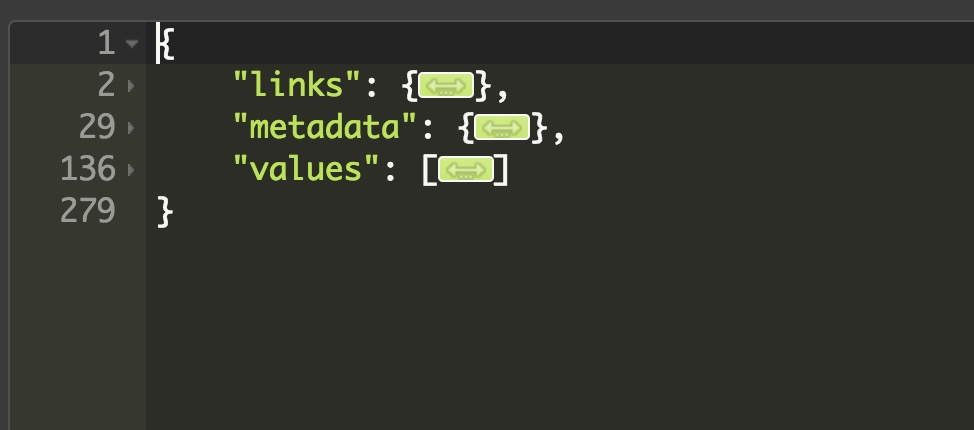

### Collections vs individual resources via a URL

The API calls we have been using are returning collections of data in the `values` array. It is possible to look up an individual resource using the primary identifier (BYU ID number). You will see an example of this later.

### Basic Lookup (filtered)

Filtering your query is another way to retrieve specific datasets. Some APIs support filters in the format `resource[attribute]=value`. The Persons v3 API utilizes dot notation filters. They allow you to look up a persons information by filtering on subresources (we will cover subresources later).

In Postman use the `Get Person Filtered` API call. Replace the value after `=` with your personal email. This result should look very similar to your previous responses.

*Note: This filter appends a wildcard character "`*`" at the end of the query so you may get multiple results if you enter a partial address.*

#### What a response looks like
We are going to break down each of the sections and what they do. Here is the response from that last request.

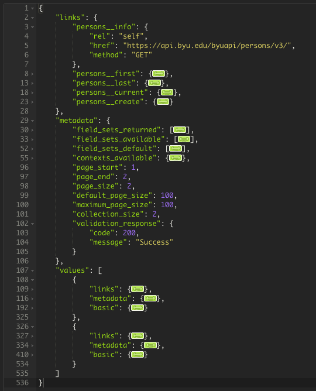

The links section of the response provides you additional routes to access clarifying information or additional results. This is especially helpful if you have many results and want to page through them.

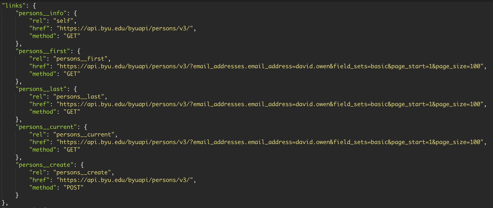

The metadata provides information on pagination of large result sets and the response code. In this case it is a simple 200 but the UAPI does specify extensive error codes to help API consumers resolve issues. The metadata also gives you information on the field sets returned and the field sets avaliable for retrieval. The Persons v3 API also supports optional `contexts` which create convienient sets of fieldsets.

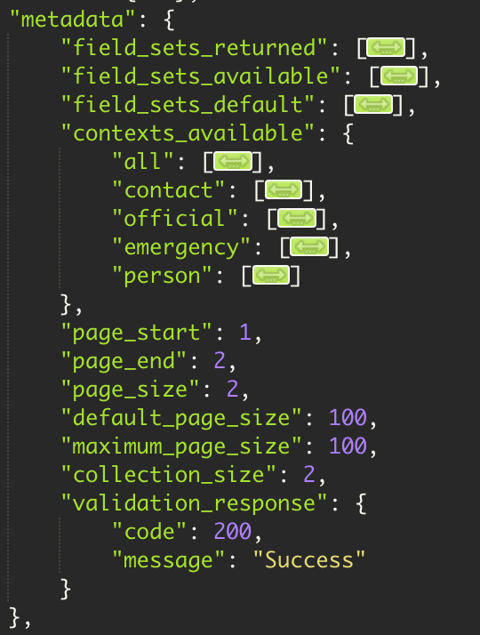

### Single resource lookup

In Postman use the `Get Persons by BYU ID` request. Replace `000000000` with your BYU ID (the number on your BYU ID card).

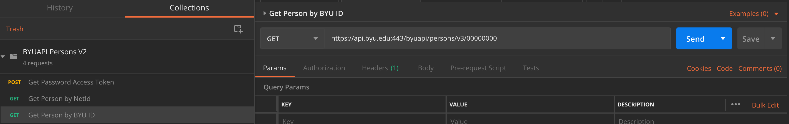

The response should include a `basic` set of data in place of the values array. This should be the same information as was returned by the previous request inside of the `values` array. This identifier ,`basic`, is a `fieldset` wich you can learn more about using to retrieve specific data.

## Exploring sub-resources

The `email_addresses` identifier we used in one of the last requests is what we call a `subresource` identifier. They can be used to filter collections or you can filter within a single users information.

In Postman look at the `Get Persons Subresource` request. It is requesting all of a persons addresses. Replace `000000000` with your BYU ID and send the request.
