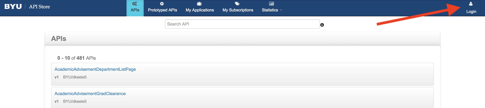

# Test-driving the Persons API With Postman

The Persons API (V2) is a good example of an API that conforms to the University API (UAPI) Specification. The Persons API provides access to a large amount of identity data if the user knows how to operate it correctly. It is also a good model for how to operate all UAPI conformant APIs.

We will use Postman - an interactive REST client - to explore some of what the Persons API can do. 

## Persons API 

## API Manager Setup

The Persons API, like all of BYU's APIs, is managed by our API Manager. In order to access any API through the API Manager a consumer must generate a set of access keys. That is our first step.  

Access the [API Manager Store](https://api.byu.edu/store). Click the `Login` button in the upper right corner of the page to authentication with the API Manager Store. Authentication is required to generate access keys.

 

Gaining access to an API through the API Manager is a two step process. First we need to create an application. Second we will have our application subscribe to use the Persons API. 

An application represents a group of APIs. For a normal application you would create one application and add subscriptions to all the APIs that application will use. We will create a single application and add a subscription for the Persons API. 

To create an application click on the `My Applications` button on the top of the page. Give the application a `Name` and optional description. The rest of the fields can be the default for this tutorial.  Click `Add` to create our new application. 

 

Now we need to generate a `client_id` and `client_secret` for our application. These uniquely identify this application to the API Manager. The `client_id` is similar to a `net_id` and is considered public. The `client_secret` is similar to a password and should be kept confidential. If the `client_secret` is compromised the application will need to be deleted and a new one created in order to generate new credentials. 

To generate the credentials click on the `My Subscriptions` button at the top of the window. Be sure that the correct application is selected and click on the `Generate keys` button. After a few seconds the keys will be displayed. The `client_id` is labeled the `Consumer Key` on the page and the `client_secret` is labeled the `Consumer Secret`. Save those two values, you'll need them later (you can always return to this page to retrieve the values when you need them). 
 
 

Now we need to find the Persons API and subscribe to it. Since there are hundreds of APIs in the store we'll search for the API. Click on the `APIs` button at the top of the page to bring up the list of APIs in the store. Enter "Persons" in the search field at the top of the page and press enter. 

 

On the list of matching APIs select version 2 (v2) of the Persons API.

 

Now we need to subscribe to the Persons API. Make sure your application is selected and click on the `Subscribe` button. This will add a subscription. 

>**Note** - the API Store has an API Console where you can try calling APIs. The console will not work for this API. 

That is it for the API Manager setup.  

## Postman Setup

We are going to use Postman to explore the Persons API. Postman is a full feature REST client that can either run as a browser extension or as a standalone application for any major OS. 

Download Postman from their [site](https://getpostman.com/apps). You can choose either a browser extension or a native application. Either will work for our purposes. You do not need to create an account with Postman unless you'd like to take advantage of some more advanced features. 

Once Postman is installed we need to create a Postman environment that will store our configuration. Download the skeleton environment for this tutorial from here {**need link to postman environment from GitHub **} 

In Postman click on the `Environment Settings` button and import the configuration file you downloaded. Once you have imported the configuration make sure the environment selection is set to "Persons". Click on the `Environment Quick Look` button to see the values in the environment. Click the `Edit` link to open the environment editor. Fill in the values for `client_id` and `client_secret` from your API Manager application. Put the values for your BYU netid and password in the `username` and `password` fields. These are necessary for authenticating to the API Manager and the Persons API. The `accessToken` will be filled in programmatically later. 

- Install persons collection

## Exploring the Persons Resource
### Collections vs individual resources via a URL

### Basic Lookup (filtered)
#### What a response looks like

### Single resource lookup

## Exploring sub-resources

